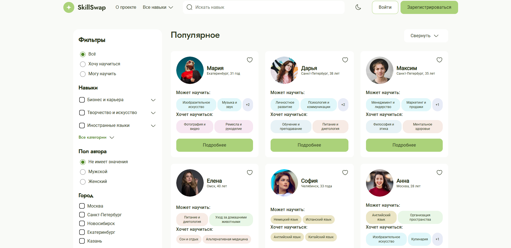

# Проект SkillSwap
<h3>Платформа обмена навыками «Я научу / Хочу научиться»</h3>


## Стэк: React + TypeScript + Vite

[Ссылка на макет в Figma](<https://www.figma.com/design/bKwOakHJI7Z2mh2zVCBphP/SkillSwap---Для-разработчиков?node-id=386-11920&t=xN1r61F4DvdVdr9v-0>) |
[Ссылка на gh pages](<https://tanyanikitina176.github.io/SkillSwap/>)


##### Скелет проекта: 
```
  src/
├── api/                         # Методы работы с мок-данными (через axios/fetch)
│   ├── Skill/                   # API-запросы, связанные с сущностью Skill
│   ├── User/                    # API-запросы, связанные с User
│   └── Request/                 # API-запросы, связанные с Request
│
├── app/                         # Корневые настройки и инфраструктура приложения
│   ├── protected-route/         # Реализация защищённых маршрутов
│   ├── store.ts                 # Глобальный Redux store
│   ├── App.tsx                  # Главный компонент приложения
│   ├── App.css                  # Стилизация App
│   └── global.css               # Глобальные CSS-стили
│
├── entities/                    # Доменные модели — основные объекты системы
│   ├── Skill/                   # Типы, slice, логика компонентов навыков
│   ├── User/                    # Пользователь: модель, логика, компоненты
│   └── Request/                 # Заявки: структура, slice, логика
│
├── features/                    # Бизнес-фичи — независимые сценарии
│   ├── auth/                    # Авторизация/регистрация
│   ├── skills/                  # Управление навыками
│   ├── favorites/               # Работа с избранным
│   └── requests/                # Работа с заявками на обмен
│
├── widgets/                     # Готовые UI-блоки, включающие фичи и сущности
│   ├── SkillCard/               # Карточка скилла
│   └── FiltersBar/              # Панель фильтров
│
├── pages/                       # Полноценные страницы (роуты)
│   ├── Home/                    # Главная страница
│   ├── Profile/                 # Профиль пользователя
│   ├── SkillDetail/            # Страница отдельного навыка
│   └── Favorites/              # Избранные навыки
│
├── shared/                      # Общие переиспользуемые элементы
│   ├── ui/                      # UI-компоненты (кнопки, поля и др.)
│   ├── hooks/                   # Пользовательские хуки (например: useDebounce, useLocalStorage)
│   └── lib/                     # Утилиты, константы, вспомогательные функции
│
└── index.tsx                    # Точка входа в приложение
public/
└── db/
    ├── skills.json              # Мок-данные с навыками
    ├── users.json               # Мок-данные с пользователями
    └── fonts/                   # Подключаемые шрифты
```

⚙️ Скрипты

| Команда           | Назначение                         |
| ----------------- | ---------------------------------- |
| `npm run dev`     | Запуск проекта в dev-режиме        |
| `npm run build`   | Сборка проекта                     |
| `npm run preview` | Предпросмотр production-сборки     |
| `npm run lint`    | Проверка ESLint                    |
| `npm run format`  | Форматирование кода через Prettier |

🚀 Установка и запуск
##### 1. Клонируй репозиторий
git clone https://github.com/your-username/skillswap.git \
cd skillswap

#### 2. Установи зависимости
npm install

#### 3. Запусти проект в dev-режиме
npm run dev


